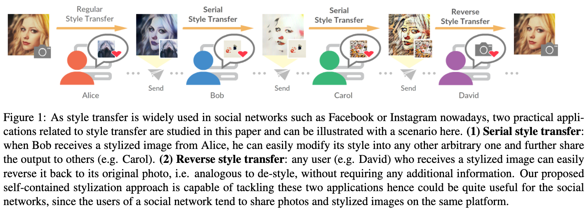
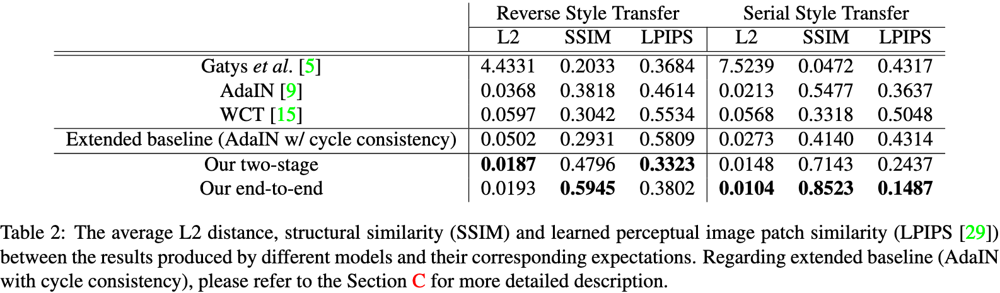

# Self-Contained Stylization via Steganographyfor Reverse and Serial Style Transfer
[[arxiv]](https://arxiv.org/pdf/1812.03910.pdf)[[WACV2020]](https://openaccess.thecvf.com/content_WACV_2020/html/Chen_Self-Contained_Stylization_via_Steganography_for_Reverse_and_Serial_Style_Transfer_WACV_2020_paper.html)[[poster]](./poster.pdf)

This is the source code of our WACV2020 paper "Self-Contained Stylization via Steganographyfor Reverse and Serial Style Transfer".



## Abstract 
Style transfer has been widely applied to give real-world images a new artistic look. However, given a stylized image, the attempts to use typical style transfer methods for de-stylization or transferring it again into another style usually lead to artifacts or undesired results. We realize that these issues are originated from the content inconsistency between the original image and its stylized output. Therefore, in this paper we advance to keep the content information of the input image during the process of style transfer by the power of steganography, with two approaches proposed: a two-stage model and an end-to-end model. We conduct extensive experiments to successfully verify the capacity of our models, in which both of them are able to not only generate stylized images of quality comparable with the ones produced by typical style transfer methods, but also effectively eliminate the artifacts introduced in reconstructing original input from a stylized image as well as performing multiple times of style transfer in series. 

## Results


## Requirements
- Python 3.5+
- PyTorch 0.4+
- TorchVision
- Pillow
- tqdm

## Usage
In each model folder, model.py define the model. In model.py, SelfContained_Style_Transfer moudle has the operations for regular, serial and reverse style transfer.
### Testing
1. download [[pretrained_weights]](https://drive.google.com/drive/folders/1ZzD6tqVS57TtlD7dDHquruGWp0GKkl_X?usp=sharing) in ./<method_dir>/model_weights/
2. test.py can operate regular, serial and reverse style transfer. 
### Training 
1. Download [MSCOCO images](http://mscoco.org/dataset/#download) and [Wikiart images](https://www.kaggle.com/c/painter-by-numbers).
2. Download [[pretrained_weights]](https://drive.google.com/drive/folders/1ZzD6tqVS57TtlD7dDHquruGWp0GKkl_X?usp=sharing)
3. run train.py as floder REMEAD.md

## Citation
```
@inproceedings{chen20wacv,
 title = {Self-Contained Stylization via Steganography for Reverse and Serial Style Transfer},
 author = {Hung-Yu Chen and I-Sheng Fang and Chia-Ming Cheng and Wei-Chen Chiu},
 booktitle = {IEEE Winter Conference on Applications of Computer Vision (WACV)},
 year = {2020}
} 
```

## Acknowledgements
Part of the code is based on [pytorch-AdaIN](https://github.com/naoto0804/pytorch-AdaIN)