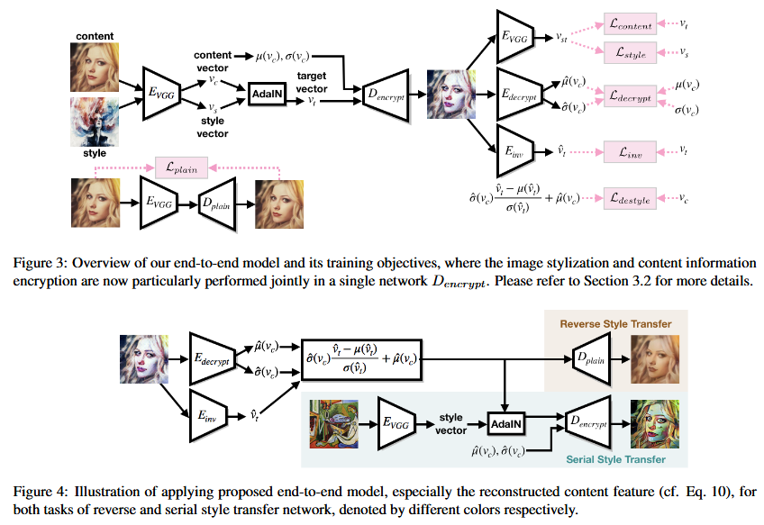

# End-to-End Model of Self-Contained Stylization
 Our end-to-end model digs deeply into the characteristic of AdaIN for enabling image stylization and content information encryptionsimultaneously in a single network.



## How to run

### test
```
python test.py --content_dir <content dir path> --style_dir <style dir path> --output_dir <output dir path> --cpu(if run without GPU)
```
### train
```
python train.py --content_dir <content dir path> --style_dir <style dir path> --result_dir <image result dir path> --log_dir <log dir path for tensorboard>  --cpt_dir <model checkpoint dir path> --vgg_path <pretrained vgg path>  --plain_decoder_path <pretrained plain decoder path> 
```
## Warning
- Only support 256x256 resolution
